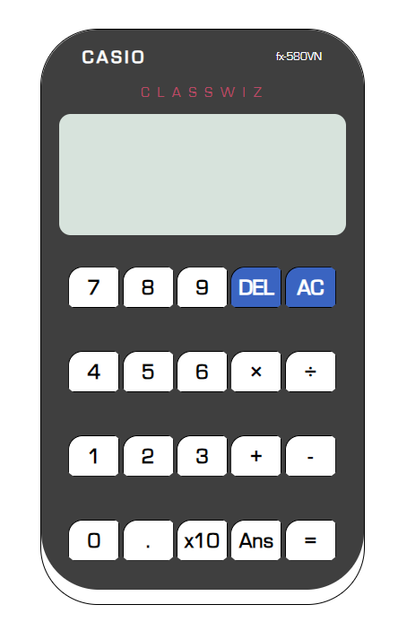

# Casio 580 Classic Calculator Look-alike

This project is a web-based simulation of the Casio 580 Classic Calculator, implemented using HTML, CSS, and JavaScript. It provides a user interface that resembles the classic calculator design and functionality.

## Features

- **Basic Arithmetic Operations:** Addition, subtraction, multiplication, and division.
- **Clear Function:** Clear the display and reset the calculator.

## Technologies Used

- **HTML:** Used for structuring the calculator interface.
- **CSS:** Used for styling the calculator to resemble the Casio 580 Classic design.
- **JavaScript:** Used for implementing the calculator logic and user interactions.

## How to Use

1. Clone the repository to your local machine using `git clone https://github.com/your-username/casio-580-calculator.git`.
2. Open the `index.html` file in your web browser.
3. Use the calculator interface to perform calculations.

## Screenshots

## Live Demo

You can try the live demo of the calculator [here](https://phdangg.github.io/Calculator/).

## Contributing

Contributions are welcome! Please fork the repository and create a pull request with your improvements.

